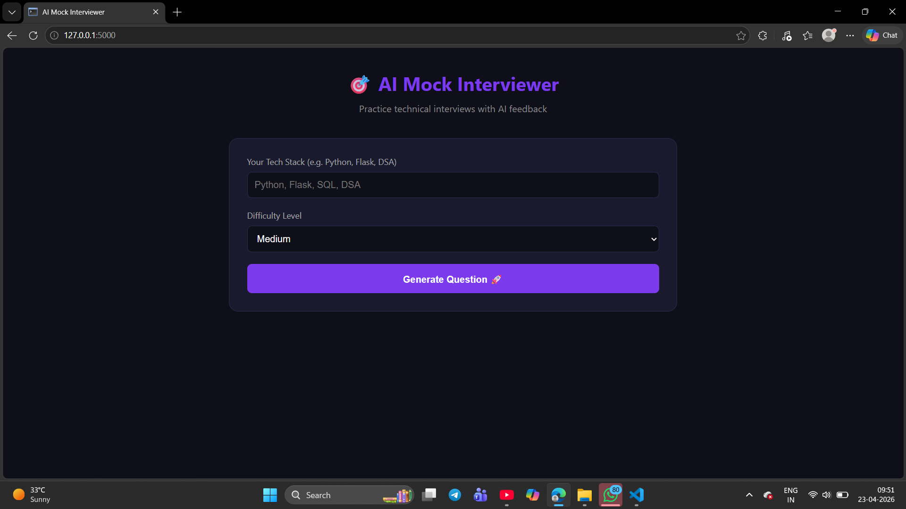
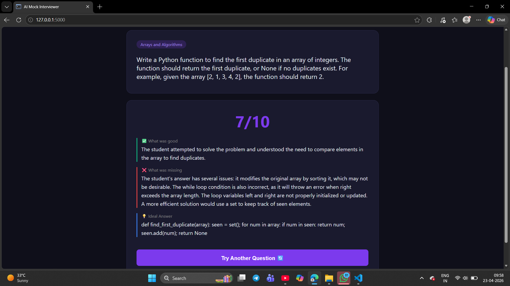

# 🎯 AI Mock Interviewer

An AI-powered technical interview preparation platform that generates 
personalized interview questions based on your tech stack and evaluates 
your answers in real-time using Large Language Models.

## 🚀 Features

- **Dynamic Question Generation** — Enter your tech stack and get 
  relevant interview questions instantly
- **AI-Powered Evaluation** — Get scored out of 10 with detailed 
  feedback on your answer
- **Ideal Answer Reference** — Learn the correct approach after 
  every attempt
- **Difficulty Levels** — Choose between Easy, Medium, and Hard
- **Clean UI** — Dark-themed, responsive interface

## 🛠️ Tech Stack

- **Backend:** Python, Flask
- **AI Model:** LLaMA 3.3-70B via Groq API
- **Frontend:** HTML, CSS, JavaScript
- **Environment:** python-dotenv

## 📦 Installation

1. Clone the repository
```bash
   git clone https://github.com/tanishkamalviya19-jpg/AI-Mock-Interview
   cd ai-mock-interviewer
```

2. Create virtual environment
```bash
   python -m venv venv
   venv\Scripts\activate
```

3. Install dependencies
```bash
   pip install flask groq python-dotenv
```

4. Create `.env` file
   GROQ_API_KEY=your_api_key_here
5. Run
```bash
   python app.py
```

6. Open `http://127.0.0.1:5000`

## 🔮 Future Scope

- Real-time camera integration for confidence scoring
- Eye contact and facial expression analysis  
- Session history and performance tracking
- Topic-wise progress dashboard
- Speech-to-text answer input

## 📁 Project Structure
ai-mock-interviewer/
├── app.py
├── requirements.txt
├── README.md
└── templates/
└── index.html
## ⚠️ Note
Never commit your `.env` file.
## 📸 Screenshots


